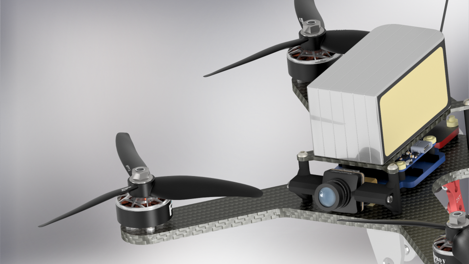
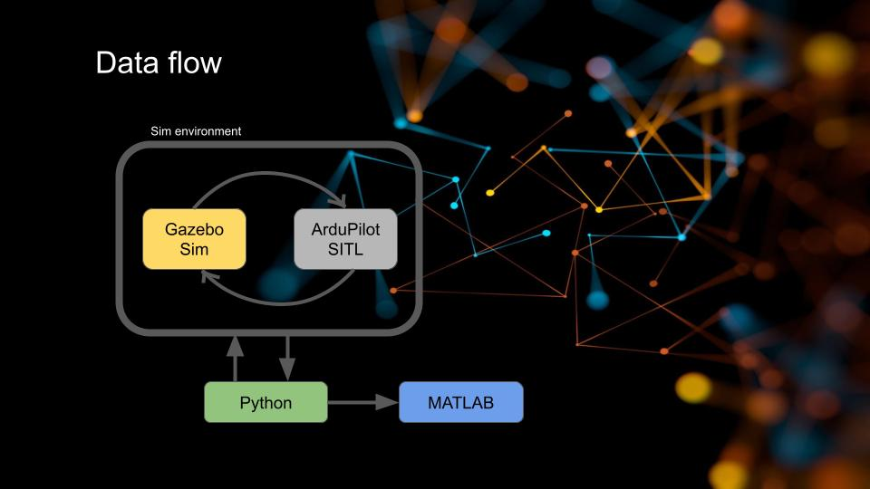

# System Identification of Quadrotor Dynamics (ARMAX) - In Virtual Environment

This repository contains the data, analysis scripts, and final models for the discrete-time ARMAX identification of a quadrotor's dynamics within a Gazebo and ArduPilot Software-in-the-Loop (SITL) environment. For this project, we designed our own custom drone airframe from scratch using Autodesk Inventor, complete with a fully functional payload dropper mechanism.

The primary focus is characterizing the vehicle's dynamics across a sudden 25% reduction in mass, simulating a mid-flight payload drop. The project demonstrates the application of linear system identification techniques to a non-linear, marginally unstable system, managing the transition between two distinct operating points, and highlighting the limitations of non-deterministic multi-layer systems in such applications.

## Key Features & Scope

- **Altitude Dynamics (Z-Axis):** Independent ARMAX models fitted for payload-attached and payload-detached configurations.
- **Attitude Dynamics (Roll Axis):** Extended identification of the roll axis dynamics (data and plots included in the repository).
- **Pipeline Diagnostics:** Critical analysis of simulation timing pathologies, including CFS scheduler jitter and non-uniform sampling artefacts in standard SITL environments.

## Methodology

The identification was conducted by bypassing the ArduCopter altitude controller and streaming effective vertical-thrust commands directly, while keeping the inner attitude and rate loops closed for stability.

- **Excitation:** A Pseudo-Random Binary Sequence (PRBS) updated at 12 Hz/5Hz, injecting $\pm0.1 / \pm10deg$ normalised thrust deviations around the stable hover equilibrium.
- **Data Pipeline:** MAVLink dataflash logs were extracted, stripped of duplicated timestamps caused by asynchronous logging, and interpolated onto a strict 50 Hz uniform grid.

- **Model Structure:** The ARMAX structure was chosen to ensure unbiased parameter estimates in the presence of coloured residuals, outperforming ARX, Output Error, and Box-Jenkins models for this plant.
- **Order Selection:** An exhaustive grid search over the polynomial orders $n_a, n_b, n_c$, and the transport delay $n_k$ was utilized to find the optimal fit without overfitting to simulation noise.

## Results and Validation

### Z axis (Alttitude)

> At the 4th marker, the payload drop occurs.

> This signal ranges from 1000 to 2000 µs and represents the overall throttle of the system. It was produced by averaging all four engine control signals; by doing so, we transitioned the plant from a MISO to a SISO system.

.png>)

> Since Linux is not an RTOS, our log samples are not evenly distributed (more on this in the limitations section). We interpolated the data onto a strict 50 Hz uniform grid to assist the ARMAX algorithm during the identification process.

.png>)

> As observed in the plots above, residual analysis reveals an emergent beat or pattern. Further investigation suggests this beat is an artefact of the non-deterministic timing within the multi-layer simulation architecture (Gazebo physics at 1000 Hz, ArduPilot flight stack at 400 Hz, and the data logger operating asynchronously).

.png>)

.png>)

> These Bode plots exhibit high-frequency corruption stemming from the same sampling timing issues that produced the autocorrelation spikes.

> This is the theoretical step response of the levitating drone to a 50 µs offset in the PWM signal.

An additional out-of-sample validation test was conducted. As shown in the figures below, we excited the plant with real operational signals driven by the active PID altitude controller. The exact same recorded effective-PWM trajectory was used to excite the ARMAX models, and the simulated response was compared against the true recorded altitude.

- **Simulation Fit:** The models achieved a 98.7% simulation fit for the payload-attached state and 99.18% for the payload-detached state on held-out validation data.

- **Out-of-Sample Tracking:** When validated against a real closed-loop flight signal, the predicted models tracked the recorded plant altitude within ±0.015 m (attached) and ±0.025 m (detached) over a four-second horizon.

### X axis (Roll)

This test was performed in a similar manner, using a PRBS excitation but at a lower update frequency (5 Hz). The input signal was derived by averaging the motor outputs on each side (left/right) and then subtracting one side from the other to isolate the roll moment.

.png>)

> As it is seen on obove plots ARMAX couldn't handle non linearities along with saturation on PID controllers which ended in failing the identyfication procces (Above plot is best result).

## System Limitations & Negative Results

A critical outcome of this project was identifying the boundary conditions where standard Gazebo and ArduPilot SITL environments fail to provide realistic data for high-frequency or highly precise timing analysis.

- **Multi-Layered Non-Deterministic System & Spectral Artefacts:** The simulation relies on a complex, asynchronous architecture (Gazebo physics operating at 1000 Hz, the ArduPilot flight stack at 400 Hz, and a data logger recording at 800 Hz). Because standard Linux is not a Real-Time Operating System (RTOS), CFS scheduler preemption introduces microsecond timing jitter. This non-deterministic pipeline results in non-uniform sampling. When running FFT analysis on the detrended IMU data, this non-uniformity generated characteristic spectral folding and artificial beat frequencies. These spectral artefacts are purely products of the simulation pipeline, not physical drone dynamics.

For simulating vibrations ArduPilot vibration module was used, where frequency was set to 160Hz (multiple amplitudes were checked).

.png>)

.png>)

- **Closed-Loop Identification Bias:** We conducted data collection and verification within a closed-loop environment. While it is necessary to keep the attitude loops closed to stabilize a marginally unstable system like a hovering quadrotor, doing so introduces a known system identification challenge. The feedback loop creates a statistical correlation between the control input and unmeasured system disturbances. We deliberately tested the ARMAX model against this closed-loop data to observe what would happen, noting that while ARMAX is robust to colored noise, this feedback-induced correlation inevitably introduces a degree of bias into the parameter estimates.

- **Non-Linear Thrust Characteristics & PID Saturation:** The ARMAX model assumes a strictly linear relationship between the input command and the resulting output. In reality, quadrotor thrust exhibits a highly non-linear, quadratic relationship with motor RPM. Furthermore, during aggressive maneuvers (such as those tested in the Roll axis), the inner PID controllers frequently drive the motor PWM signals into their hardware saturation limits. The linear model structure cannot account for the core aerodynamic non-linearity or the hard clipping caused by PID saturation, which significantly degraded fit accuracy during roll changes.
